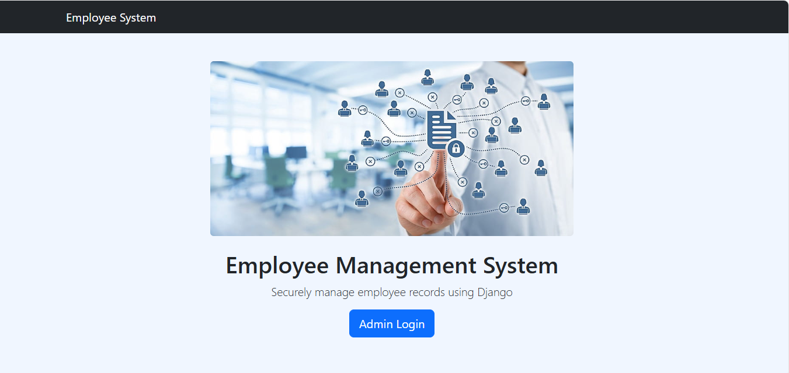
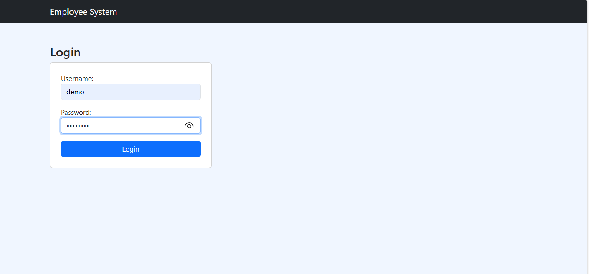
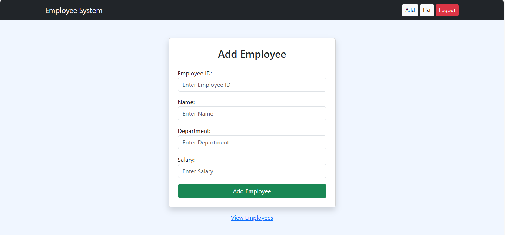

# Employee Management System (Django)

A full-stack **Employee Management System** built using **Python & Django**, deployed on **Render**.  
This project allows secure management of employee records with authentication and CRUD operations.

---

## 🔗 Live Demo

🌐 **Live URL:**  
https://employee-management-system-69sy.onrender.com

> ⚠️ Note: Free Render instance may take 30–50 seconds to wake up.

---

## 🔐 Demo Login Credentials (For Recruiters)

Use the following credentials to explore the system:

- **Username:** demo  
- **Password:** demo@123  

👉 Demo user can:
- Login from Home Page
- Add employees
- View employee list
- Update employee details
- Delete employee records

❌ Demo user **cannot access Django Admin Panel**

---

## 🚀 Features

- User authentication (Login / Logout)
- Employee CRUD operations:
  - Add Employee
  - View Employee List
  - Update Employee
  - Delete Employee
- Form validation (salary, required fields)
- Pagination & Search
- Secure session-based access
- Responsive UI using Bootstrap
- Static file handling (images, CSS)
- Deployed on Render

---

## 🛠️ Tech Stack

- **Backend:** Python, Django
- **Frontend:** HTML, CSS, Bootstrap
- **Database:** SQLite (can be upgraded to PostgreSQL)
- **Deployment:** Render
- **Version Control:** Git & GitHub

---

## 📂 Project Structure

emp_project/
│
├── emp_project/
│ ├── settings.py
│ ├── urls.py
│ ├── wsgi.py
│
├── employee/
│ ├── migrations/
│ ├── static/
│ │ └── employee/images/home.jpg
│ ├── templates/
│ │ ├── base.html
│ │ ├── home.html
│ │ ├── login.html
│ │ ├── add.html
│ │ ├── list.html
│ │ └── update.html
│ ├── forms.py
│ ├── models.py
│ ├── views.py
│
├── requirements.txt
├── manage.py
└── README.md


---

## 📸 Screenshots

### 🏠 Home Page


### 🔐 Login Page


### 📋 Employee List


### ➕ Add Employee


---

## ⚙️ Local Setup Instructions

```bash
git clone https://github.com/vikasbachpalle/employee-management-system.git
cd employee-management-system
python -m venv venv
source venv/bin/activate   # Windows: venv\Scripts\activate
pip install -r requirements.txt
python manage.py migrate
python manage.py createsuperuser
python manage.py runserver
```


👨‍💻 Author

Vikas Bachpalle
📍 Hyderabad / Pune
🔗 GitHub: https://github.com/vikasbachpalle

📌 Note for Recruiters

This project demonstrates:

Django fundamentals

Authentication & authorization

CRUD operations

Real-world deployment

Clean code structure

Future enhancements can include:

PostgreSQL integration

Role-based access

Email notifications

